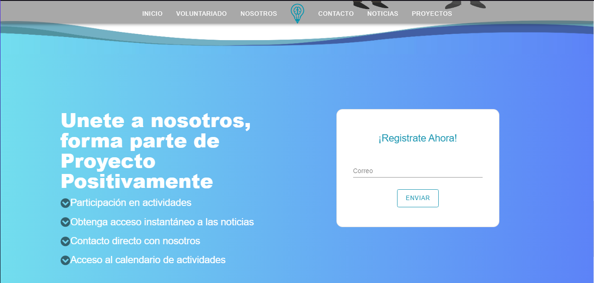

# Project Positivamente


### Developed for a foundation that provides humanitarian aid, managing volunteers, activities, conferences, etc...

### Because the foundation required to improve the management and control processes in their projects and conferences, as well as the volunteers who wish to participate, offering a pleasant experience during the management of the various modules that represent the system.

### The application was developed an Api Rest which is located in the following repository: [API REST](https://github.com/sourclab/ApiPositivamente)

---

## Functions

#### **All management functions have their main methods of Add, Delete, Display and Update**.

**Home pages**

- Home
- Volunteering
- About Us
- Contact Us
- News & Events
- Projects

**Administrators control panel**.

- Manage Workdays.
- Manage Projects.
- Manage News.
- Manage Users.
  - Volunteers
  - Managers
- General visualization of all registered activities
- Generation of reports by date in PDF format.
  - Projects
  - Workshops
  - Volunteers

* Database backup
* Database Restoration
* Download of user manual (administrator version)

**Users control panel**.

- Visualization of active workshops for participation
- Schedule of workshops
- User profile
- Download user manual (user version)

## Installation

1. Clone application repository

```bash
git clone https://github.com/sourclab/Positivamente.git
```

2. Clone Api repository (follow api installation instructions to continue)

```bash
git clone https://github.com/sourclab/ApiPositivamente.git
```

3. Updating libraries

```bash
npm install
```

4. Start application

```bash
npm run serve
```

## Screen Captures





